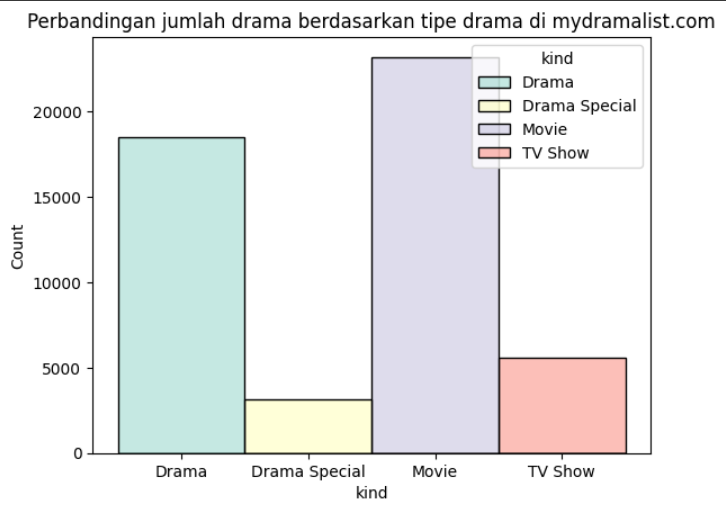

# Laporan Proyek Machine Learning - Hajid Lutfi Hidayanto

Proyek ini adalah proyek kedua untuk submission dicoding. Proyek ini berjudul **mydramalist.com Recomennder System**, yaitu Sistem rekomendasi untuk website mydramalist.com yang dibangun menggunakan content based filtering dan collaborative filtering.

## Project Overview

Mydramalist.com adalah situs web populer yang menyediakan informasi tentang drama. Dengan banyaknya pilihan drama yang tersedia, pengguna mungkin kesulitan menemukan drama yang sesuai dengan selera mereka.

Proyek ini bertujuan untuk membangun sistem rekomendasi untuk Mydramalist.com yang dapat membantu pengguna menemukan drama yang sesuai dengan minat mereka. Sistem ini akan menggunakan content based filtering dan model based filtering untuk menganalisis data pengguna dan drama, dan kemudian merekomendasikan drama yang kemungkinan besar disukai pengguna.

Sistem rekomendasi ini penting karena membantu pengguna Mydramalist.com menemukan drama yang sesuai dengan minat mereka dengan lebih mudah dan efisien. Hal ini dapat meningkatkan kepuasan pengguna dan meningkatkan kemungkinan mereka untuk kembali ke Mydramalist.com.

Sistem rekomendasi akan dibuat menggunakan model machine learning. Model machine learning dapat membantu Mydramalist.com dengan menganalisis data tentang drama dan perilaku pengguna. Dengan begitu, model dapat merekomendasikan drama yang kemungkinan besar disukai pengguna.

Model machine learning dapat membantu Mydramalist.com meningkatkan akurasi, personalisasi, dan efisiensi sistem rekomendasi. Hal ini dapat membantu pengguna menemukan drama yang mereka sukai dengan lebih mudah dan meningkatkan kepuasan pengguna secara keseluruhan.

<!-- **Rubrik/Kriteria Tambahan (Opsional)**:
- Jelaskan mengapa proyek ini penting untuk diselesaikan.
- Menyertakan hasil riset terkait atau referensi. Referensi yang diberikan harus berasal dari sumber yang kredibel dan author yang jelas.
  
  Format Referensi: [Judul Referensi](https://scholar.google.com/)  -->

## Business Understanding
<!-- 
Pada bagian ini, Anda perlu menjelaskan proses klarifikasi masalah.

Bagian laporan ini mencakup: -->

### Problem Statements

Berikut adalah pernyataan masalah yang diidentifikasi dalam proyek ini:

- Bagaimana Mydramalist.com dapat lebih memahami preferensi dan minat pengguna?
- Bagaimana Mydramalist.com dapat meningkatkan kepuasan pengguna dengan sistem rekomendasi drama?
- Bagaimana Mydramalist.com dapat meningkatkan jumlah pengguna aktif?

### Goals

Berikut adalah tujuan proyek ini untuk menjawab pernyataan masalah di atas:

- Membangun sistem rekomendasi yang dapat membantu pengguna Mydramalist.com menemukan drama yang sesuai dengan minat mereka dengan mudah dan efisien.  
- Meningkatkan kepuasan pengguna Mydramalist.com dengan rekomendasi drama yang lebih akurat dan relevan.  
- Meningkatkan jumlah pengguna aktif Mydramalist.com dengan menawarkan pengalaman pengguna yang lebih baik.  

### Solution statements
Berikut adalah dua solusi yang diusulkan untuk mencapai tujuan proyek:

1. **Sistem Rekomendasi Content-Based Filtering**    

    - Merekomendasikan drama berdasarkan kesamaan dengan drama yang disukai pengguna di masa lalu.
    - Sistem akan menganalisis data tentang drama yang disukai pengguna, seperti genre, aktor, sutradara, dan rating.
    - Sistem kemudian akan merekomendasikan drama yang memiliki kesamaan dengan drama yang disukai pengguna di masa lalu.
2. **Sistem Rekomendasi Collaborative Filtering**:

    - Merekomendasikan drama berdasarkan preferensi pengguna lain yang memiliki selera yang sama.
    - Sistem akan menganalisis data rating drama dari semua pengguna Mydramalist.com.
    - Sistem kemudian akan merekomendasikan drama yang disukai oleh pengguna lain yang memiliki selera yang sama dengan pengguna.

## Data Understanding
<!-- Paragraf awal bagian ini menjelaskan informasi mengenai jumlah data, kondisi data, dan informasi mengenai data yang digunakan. Sertakan juga sumber atau tautan untuk mengunduh dataset. Contoh: [UCI Machine Learning Repository](https://archive.ics.uci.edu/ml/datasets/Restaurant+%26+consumer+data). -->
Dataset yang digunakan dalam proyek ini adalah dataset mydramalist-ratings yang diunduh di [Kaggle](https://www.kaggle.com/datasets/amarang/mydramalist-ratings).

<!-- Selanjutnya, uraikanlah seluruh variabel atau fitur pada data. Sebagai contoh:   -->
### Variabel
Variabel-variabel pada mydramalist-ratings Dataset adalah sebagai berikut:
1. **File df_shows**: File ini berisi informasi tentang shows, dengan variabel sebagai berikut:
    - country (category): Negara asal shows.
    - year (int): Tahun produksi shows.
    - kind (category): Tipe shows (misalnya, movie, drama, special).
    - title (category): Judul shows.
    - sid (int): ID unik untuk setiap shows.
2. **File df_users**: File ini berisi informasi tentang pengguna Mydramalist.com, dengan variabel sebagai berikut:
    - username (object): Nama pengguna.
    - gender (category): Jenis kelamin pengguna.
    - join_date (datetime): Tanggal bergabung pengguna di Mydramalist.com.
    - last_online (datetime): Tanggal terakhir pengguna aktif di Mydramalist.com.
    - ndropped (int): Jumlah shows yang ditonton tetapi tidak selesai pengguna.
    - ncompleted (int): Jumlah shows yang diselesaikan pengguna.
    - uid (int): ID unik untuk setiap pengguna.
3. **FIle df_pairs**: File ini berisi informasi tentang interaksi pengguna dengan shows, dengan variabel sebagai berikut:
     - score (float): Rating yang diberikan pengguna terhadap shows (nilai desimal).
     - sid (int): ID unik untuk setiap shows (menghubungkan ke df_shows).
     - uid (int): ID unik untuk setiap pengguna (menghubungkan ke df_users).
     - ep_seen (int): Jumlah episode yang sudah ditonton pengguna.
     - ep_total (int): Jumlah total episode shows.
     - completed (boolean): Menunjukkan apakah pengguna telah menyelesaikan shows (True) atau belum (False).

### Exploratory Data Analysis
1. Jumlah data  
Berikut rincian jumlah data per file:  
- Jumlah data pairs: 14.108.062  
- Jumlah data shows: 50.411  
- Jumlah data users: 84.607  

2. Berikut adalah EDA untuk setiap file:  
    1. **File df_shows**
        - Memberikan informasi umum terkait shows pada mydramalist.com.
        - Tidak terdapat null dalam file.
        - Terdapat 18 data yang mempunyai duplikat berdasarkan sid  

            |       |     country | year |  kind |                  title |   sid |
            |------:|------------:|-----:|------:|-----------------------:|------:|
            | 45996 | South Korea | 2011 | Movie |       A Reason to Live |  2188 |
            | 18087 | South Korea | 2011 | Movie |       A Reason To Live |  2188 |
            |  4437 |       China | 2014 | Drama |        Scarlet Heart 2 |  4296 |
            | 28975 |       China | 2014 | Drama | Scarlet Heart Season 2 |  4296 |
            |  3646 | South Korea | 2020 | Movie |        Are We In Love? | 18636 |
            | 16152 | South Korea | 2020 | Movie |        Are We in Love? | 18636 |

            *Table 1. Data dengan duplikat*

            Tabel di atas adalah contoh data yang memiliki duplicates. Masalah ini diselesaikan dengan menelusuri website mydramalist.com untuk menentukan data yang benar.
        - Perbandingan jumlah drama berdasarkan tipe drama.  
          
        *Gambar 1. Perbandingan jumlah drama berdasarkan tipe*  

            Ada 4 tipe drama:  
                1. Drama: Tipe shows ber-*genre* drama yang terdiri dari beberapa episode. Durasi 1 episode umumnya sekitar 1 jam.   
                2. Drama special: Tipe drama yang terdiri dari episode spesial. Umumnya ceritanya didasarkan dari suatu drama. Umumnya jumlah episode nya lebih sedikit daripada drama *original*-nya.  
                3. Movie: Tipe shows yang berbentuk film/movie. Umumnya durasinya sekitar 2 jam.  
                4. TV show: Tipe shows yang ditayangkan di televisi.     

            Dapat diinterpretasikan dari Gambar 1 bahwa jumlah shows bertipe Movie paling banyak dan berbeda tipis dengan Drama. Sedangkan jumlah tipe Drama Special & TV Shows jauh lebih sedikit dari pada Movie. 
        - Perbandingan jumlah drama berdasarkan negara asal drama.  
          
        *Gambar 2. Perbandingan jumlah drama berdasarkan negara*  
        
            Dari Gambar 2, dapat diinterpretasikan bahwa jepang dan korea selatan mendominasi jumlah shows yang ada di mydramalist.com. Negara dengan jumlah shows paling sedikit adalah singapure, yaitu dengan 1 shows berjudul "The Big Day".
        
    2. **File df_users**
        - Memberikan informasi terkait pengguna/user website mydramalist.com.
        - Terdapat 578 data null pada fitur join_date dan 579 data null pada fitur last_online. Hal ini dapat dibiarkan saja karena fitur-fitur tersebut tidak dipakai.
        - TIdak ada duplikat pada data.
        - Perbandingan jumlah pengguna berdasarkan gender.  
          
        *Gambar 3. Perbandingan jumlah pengguna berdasarkan gender*  

            Keterangan Gambar 3:
            1. F: Female
            2. M: Male
            3. U: Unknown (tidak memilih gender)

            Pengguna website mydramalist.com didominasi oleh perempuan dengan 70% dari total pengguna adalah perempuan.
    3. **File df_pairs**
        - Memberikan informasi terkait rating show pada mydramalist.com.
        - Tidak terdapat null pada dataset.
        - Rating mempunyai range [0, 10].
        - Mean/rata-rata rating adalah 6.282575. 
        - Distribusi rating shows mydramalist.com.  
            
        *Gambar 4. Distribusi rating*  
            Dapat diinterpretasikan bahwa sebagian besar pengguna jika menyukai sebuah shows maka kemungkinan besar akan memberikan rating 7-10. Sedangkan, jika tidak menyukai sebuah shows, pengguna cenderung memberikan rating 0.
                    
<!-- **Rubrik/Kriteria Tambahan (Opsional)**:
- Melakukan beberapa tahapan yang diperlukan untuk memahami data, contohnya teknik visualisasi data beserta insight atau exploratory data analysis. -->

## Data Preparation

Langkah-langkah data preprocessing:  

1. **Menghilangkan Data Duplikat (pada file df_shows)** 

    Langkah ini penting untuk memastikan bahwa data yang dianalisis tidak mengandung duplikat, yang dapat menyebabkan hasil yang tidak akurat. Data duplikat dapat muncul karena berbagai alasan, seperti kesalahan input data atau penggabungan data dari beberapa sumber. Alasan hal ini dilakukan adalah untuk mencegah hasil yang tidak akurat, seperti overfitting model. 
    Jumlah data setelah tahap ini:

    data pairs: 14108062
    data shows: 50393
    data users: 84607

2. **Features Extraction (content based filtering)** 

    Langkah ini bertujuan untuk mengekstrak fitur yang relevan dari data. Dalam hal ini, fitur yang dipilih adalah kolom "**kind**" dan "**country**" dari file df_shows. Kedua kolom ini kemudian digabungkan untuk membentuk satu fitur baru yang lebih informatif. Alasan hal ini dilakukan adalah agar model dapat memahami data lebih baik.

3. **Membatasi data training (content based filtering)**

    Alasan langkah ini dilakukan untuk mengatasi keterbatasan memori (RAM). Cosine similarity adalah algoritma yang membutuhkan banyak memori saat menghitung kemiripan antar data. Oleh karena itu, hanya sebagian data, yaitu sebanyak 10000, yang diambil untuk memastikan bahwa proses berjalan dengan lancar. 

4. **TF-IDF (content based filtering)**

    TF-IDF (Term Frequency-Inverse Document Frequency) adalah teknik yang digunakan untuk menilai pentingnya sebuah kata dalam sebuah dokumen. Singkatnya, TF-IDF menilai seberapa sering sebuah kata muncul dalam dokumen tertentu (TF) dibandingkan seberapa sering kata itu muncul di seluruh dokumen yang dianalisis (IDF). Langkah ini dilakukan karena TF-IDF membantu menangkap kata kunci relevan, membobot kata, dan meningkatkan kinerja content-based filtering dengan memberi nilai tinggi pada kata yang sering muncul di dokumen tertentu dan jarang di seluruh dokumen.

5. **Mengubah TF-IDF matrix menjadi sparse matrix (content based filtering)**

    Langkah ini dilakukan untuk mengoptimasi memori dan komputasi. TF-IDF matrix yang padat menyimpan banyak nilai nol, sehingga kurang efisien. Sparse matrix mengatasi hal ini dengan hanya menyimpan nilai penting (di atas ambang batas tertentu) yang umumnya sedikit, sehingga menghemat ruang penyimpanan.

6. **Features extraction (collaborative filtering)** 

    Langkah ini bertujuan untuk mengekstrak fitur yang relevan untuk collaborative filtering. Dalam hal ini, fitur yang dipilih adalah 'uid', 'sid', dan 'score'. Hal ini dilakukan karena Fitur-fitur ini akan digunakan untuk membangun model collaborative filtering yang dapat merekomendasikan shows kepada pengguna berdasarkan preferensi pengguna lain. Langkah ini dilakukan untuk membantu model untuk belajar lebih efektif dan menghasilkan rekomendasi yang lebih personal dan tepat sasaran.

7. **Encoding Data User ID (uid) dan Shows ID (sid) (collaborative filtering)**

    Encoding dalam konteks ini bertujuan untuk menyandikan ID (baik uid maupun sid) ke dalam nilai integer agar lebih kecil dan mudah diproses oleh model.

8. **Scaling Data Score menjadi 0-1 (collaborative filtering)**

    Data score pada Mydramalist.com memiliki rentang nilai 0-10. Ini akan lebih baik jika data memiliki rentang yang lebih kecil. Oleh karena itu, data score diubah menjadi range 0-1. Proses ini disebut dengan scaling. Alasan digunakan scaling adalah untuk memudahkan model dalam proses training. Angka yang lebih kecil dan normal dapat lebih mudah diproses oleh model.

9. **Membagi Data Train dan Validation (90:10) (collaborative filtering)**

    Data yang tersedia dibagi menjadi dua bagian: data train dan data validation. Pada project ini, data dibagi dengan rasio 90:10. Artinya, 90% data digunakan untuk train dan 10% data digunakan untuk validation. Tahap ini penting dilakukan untuk menyiapkan data training dan data uji model.

<!-- **Rubrik/Kriteria Tambahan (Opsional)**: 
- Menjelaskan proses data preparation yang dilakukan
- Menjelaskan alasan mengapa diperlukan tahapan data preparation tersebut. -->

## Modeling

**Model yang Digunakan**:

- **Content-Based Filtering (Cosine Similarity):** Model ini merekomendasikan shows berdasarkan kesamaan konten dengan shows yang disukai pengguna sebelumnya. Cosine similarity adalah teknik yang digunakan untuk mengukur kesamaan antara dua dokumen (teks) berdasarkan "sudut" yang dibentuk oleh vektor representasi dokumen tersebut. Cosine similarity digunakan karena akurat, efisien, mudah diimplementasikan, dan cocok untuk data teks. Teknik ini fleksibel dan dapat dikombinasikan dengan teknik lain untuk meningkatkan performanya. Cosine similarity juga dapat menangani data sparse, tidak memerlukan data label, dan dapat mengukur kesamaan antar dokumen dengan panjang yang berbeda.

   Cara kerja cosine similarity adalah dengan membandingkan "sudut" antara dua vektor. Semakin kecil sudutnya, semakin mirip kedua vektor tersebut. Cosine similarity dihitung dengan membagi perkalian titik antara dua vektor dengan panjang masing-masing vektor.

   - Perkalian titik mengukur sejauh mana dua vektor searah, sedangkan panjang vektor menunjukkan seberapa besar magnitudo vektor tersebut. Nilai cosine similarity akan menghasilkan angka antara 0 dan 1.
     - Nilai 1 menunjukkan kedua vektor searah sempurna (user dan film sangat mirip).
     - Nilai 0 menunjukkan kedua vektor tegak lurus (user dan film tidak memiliki kemiripan).
     - Nilai di antara 0 dan 1 menunjukkan kemiripan parsial.

   Parameter yang digunakan dalam model ini adalah sparse matrix yang dikonversi dari TF-IDF matrix yang berparameter data fitur 'kind country'.

- **Collaborative Filtering (RecommenderNet):** Model ini merekomendasikan shows berdasarkan preferensi pengguna lain yang memiliki kesamaan selera. RecommenderNet adalah model deep learning yang digunakan dalam collaborative filtering untuk merekomendasikan item kepada pengguna. Model ini bekerja dengan mempelajari pola interaksi antara pengguna dan item (dalam kasus ini, pengguna dan shows) berdasarkan data rating. RecommenderNet dipilih dalam proyek karena kemampuan kuatnya dalam menemukan pola kompleks dalam data, fleksibilitasnya untuk disesuaikan dengan berbagai jenis dataset dan output, serta kemampuannya yang skalabel untuk menangani beban kerja yang besar. Selain itu, RecommenderNet mampu mengatasi data yang beragam dan memanfaatkan informasi kontekstual tambahan untuk meningkatkan kualitas rekomendasi.

   Cara kerja model:
   1. Mempelajari preferensi pengguna:
      - Model ini menggunakan data interaksi pengguna, seperti rating, tontonan, dan lain sebagainya, untuk mempelajari preferensi pengguna.
      - Model ini kemudian mengelompokkan pengguna yang memiliki preferensi similar.
   2. Merepresentasikan pengguna dan pertunjukan:
      - Model ini menggunakan teknik embedding untuk merepresentasikan pengguna dan pertunjukan sebagai vektor laten.
      - Vektor laten ini adalah representasi numerik dari preferensi pengguna dan karakteristik pertunjukan.
      - Dimensi vektor laten ini biasanya kecil, seperti 32, 64, atau 128.
   3. Menghitung skor prediksi:
      - Model ini menghitung skor prediksi untuk setiap pertunjukan berdasarkan kesamaan antara vektor laten pengguna dan vektor laten pertunjukan.
      - Kesamaan ini dihitung dengan menggunakan dot product.
      - Model ini kemudian menggunakan fungsi sigmoid untuk menghasilkan skor prediksi antara 0 dan 1.
      - Pertunjukan dengan skor prediksi tinggi akan direkomendasikan kepada pengguna.

   Parameter yang digunakan dalam model ini:
   - num_users=num_users : Jumlah user dalam dataset.
   - num_shows=num_users : Jumlah shows dalam dataset.
   - embedding_size=200 : Dimensi vektor embedding untuk user dan film/serial.
   - Loss function = BinaryCrossentropy() : Fungsi untuk mengukur kesalahan model.
   - Fungsi optimizer = Nadam dengan learning rate 0.0001 atau 1e-4 : Fungsi yang digunakan untuk memperbarui parameter model.

**Top-N Recommendation**:

Kedua model menghasilkan top-N recommendation, di mana N adalah jumlah shows yang direkomendasikan. N dapat diubah sesuai dengan kebutuhan.

Content-based filtering:  

- Input:

    | year |             title |   sid |      kind country |
    |-----:|------------------:|------:|------------------:|
    | 2019 | Melting Me Softly | 25652 | Drama South Korea |

    *Table 2. Input data model content-based filtering*

- Shows mirip dengan 'Melting Me Softly':

    |   |                       title |      kind country |
    |--:|----------------------------:|------------------:|
    | 0 |              Missing Noir M | Drama South Korea |
    | 1 |          Boarding House #24 | Drama South Korea |
    | 2 | Between Friendship and Love | Drama South Korea |
    | 3 |                Birdie Buddy | Drama South Korea |
    | 4 |                     Big Man | Drama South Korea |
    
    *Table 3. Hasil rekomendasi model content-based filtering*

Collaborative-filtering:

- User id: 5052

- Shows dengan rating tinggi dari user:

    |      |                    title |  kind |
    |-----:|-------------------------:|------:|
    |  97  |           Move to Heaven | Drama |
    |  132 |                 Stranger | Drama |
    |  432 |               Love Alarm | Drama |
    | 2004 | Misaeng: Incomplete Life | Drama |
    | 4929 |    Like Father, Like Son | Movie |

    *Table 4. Shows dengan rating tinggi dari user uid 5052*

- Recommendations:   

    |       |                        title |  kind |
    |------:|-----------------------------:|------:|
    |  2821 |                   Departures | Movie |
    |  8631 |              White Vengeance | Movie |
    |  9502 |            A Handful of Love | Drama |
    | 10545 |      My Sister, The Pig Lady | Movie |
    | 14683 |           The Breaking Point | Drama |
    | 16414 | 4 Shimai Tantei Dan          | Drama |
    | 22168 | The File of Justice Season 5 | Drama |
    | 22368 | Viva! Love                   | Movie |
    | 34191 | Cupid Above                  | Drama |
    | 48969 | Hooligan Sparrow             | Movie |

    *Table 5. Hasil rekomendasi model collaborative filtering*

**Kelebihan dan Kekurangan**:

**Content-Based Filtering:**

- **Kelebihan:**
    - Mudah diinterpretasikan.
    - Tidak memerlukan data rating dari pengguna lain.

- **Kekurangan:**
    - Kurang akurat dibandingkan collaborative filtering.
    - Sulit untuk merekomendasikan shows baru yang belum pernah dilihat pengguna sebelumnya.
    - Butuh ram besar, data yang dipakai hanya bisa 1/5 data asli karena keterbatasan ram google colab. 
    - Karena data dipakai hanya 1/5 data asli membuat rekomendasi terbatas.  

**Collaborative Filtering:**

- **Kelebihan:**
    - Lebih akurat dibandingkan content-based filtering.
    - Dapat merekomendasikan shows baru yang belum pernah dilihat pengguna sebelumnya.

- **Kekurangan:**
    - Membutuhkan data rating dari pengguna lain.
    - Sulit untuk diinterpretasikan.
    - Waktu training lama.

## Evaluation
<!-- Pada bagian ini Anda perlu menyebutkan metrik evaluasi yang digunakan. Kemudian, jelaskan hasil proyek berdasarkan metrik evaluasi tersebut.

Ingatlah, metrik evaluasi yang digunakan harus sesuai dengan konteks data, problem statement, dan solusi yang diinginkan.

**Rubrik/Kriteria Tambahan (Opsional)**: 
- Menjelaskan formula metrik dan bagaimana metrik tersebut bekerja. -->

**Content-Based Filtering**  

Metrik evaluasi yang digunakan adalah Precision. Precision mengukur proporsi prediksi positif yang benar dari total prediksi yang dikategorikan sebagai positif. Metrik ini dihitung dengan rumus:

$Precision = \dfrac{Total Rekomendasi Yang Relevan}{Total Rekomendasi}$  

Precision menunjukkan seberapa akurat model dalam mengidentifikasi data positif.  

**Collaborative FIltering**

Metrik evaluasi yang digunakan adalah Root Mean Square Error (RMSE). RMSE merupakan metrik yang umum digunakan untuk mengevaluasi model regresi, termasuk model rekomendasi.

### Formula RMSE:

$ RMSE = \sqrt{\frac{1}{n} \sum(y_i - p_i)^2} $

di mana:

- **n** adalah jumlah data
- **y_i** adalah nilai aktual
- **p_i** adalah nilai prediksi

RMSE mengukur rata-rata kesalahan kuadrat antara nilai prediksi dan nilai aktual. Semakin kecil nilai RMSE, semakin akurat model.

### Hasil Evaluasi:

**Content-Based Filtering**

Dari tabel 2 dan 3, dapat dihitung nilai Precision untuk model ini:

total rekomendasi relevan = 5   
total rekomendasi = 5  

$ \frac{5}{5} = 1 $

Jadi precision model ini adalah 1 atau 100%.

**Collabrative Filtering**  

  
*Gambar 4. RMSE model saat training*  

Dari gambar 4, dapat disimpulkan bahwa model tidak overfit maupun underfit.  
Nilai RMSE untuk model RecommenderNet pada project ini adalah:  
validation rmse = 0.2628  
training rmse = 0.2659   

$ \frac{0.2628 + 0.2659}{2} = 0.26453 $

Nilai ini menunjukkan bahwa model RecommenderNet cukup akurat dalam memberikan rekomendasi.

### Interpretasi Hasil:

**Collabrative Filtering**  

Nilai RMSE = 0.26453 berarti rata-rata kesalahan prediksi adalah 0.26453 unit. Dalam konteks project ini, hal ini berarti rata-rata rekomendasi yang diberikan oleh model RecommenderNet berbeda 0.26453 unit dari nilai rating yang sebenarnya diberikan oleh pengguna. Nilai ini cukup baik dengan mempertimbangkan range rating 0-10, berarti kesalahan prediksi adalah $ \frac{0.26453}{10} =  2.6453\% $

## Kesimpulan
**Perbandingan Model:**

Berdasarkan hasil evaluasi, model collaborative filtering terbukti lebih baik daripada model content-based. Hal ini kemungkinan disebabkan oleh beberapa faktor:

- Data yang dicakup oleh model content-based hanya 1/5 dari data asli. Hal ini membuat model content-based kurang akurat dalam memberikan rekomendasi.
- Model collaborative filtering dapat memanfaatkan data interaksi antar pengguna. Data ini dapat membantu model collaborative filtering dalam memahami preferensi pengguna dengan lebih baik. Model ini memiliki rmse sebesar 0.26453 yang dinilai akurat.

Oleh karena itu, model final yang dipilih adalah model collaborative filtering dengan RecommenderNet.

**Pencapaian Goals:**

Berdasarkan hasil evaluasi, dapat disimpulkan bahwa goals project ini telah tercapai.

1. **Membangun sistem rekomendasi yang dapat membantu pengguna Mydramalist.com menemukan drama yang sesuai dengan minat mereka dengan mudah dan efisien:**
   - Model RecommenderNet terbukti mampu memberikan rekomendasi yang akurat dan relevan bagi pengguna. Model ini dapat membantu pengguna menemukan drama yang sesuai dengan minat mereka dengan mudah dan efisien.

2. **Meningkatkan kepuasan pengguna Mydramalist.com dengan rekomendasi drama yang lebih akurat dan relevan:**
   - Berdasarkan hasil evaluasi, model RecommenderNet memberikan rekomendasi yang lebih akurat dan relevan daripada model content based filtering. Hal ini diharapkan dapat meningkatkan kepuasan pengguna Mydramalist.com.

3. **Meningkatkan jumlah pengguna aktif Mydramalist.com dengan menawarkan pengalaman pengguna yang lebih baik:**
   - Dengan meningkatkan kepuasan pengguna, diharapkan jumlah pengguna aktif Mydramalist.com akan meningkat. Pengalaman pengguna yang lebih baik dengan rekomendasi yang akurat dan personal dapat menarik lebih banyak pengguna untuk menggunakan platform ini.

<!-- 
**---Ini adalah bagian akhir laporan---**

_Catatan:_
- _Anda dapat menambahkan gambar, kode, atau tabel ke dalam laporan jika diperlukan. Temukan caranya pada contoh dokumen markdown di situs editor [Dillinger](https://dillinger.io/), [Github Guides: Mastering markdown](https://guides.github.com/features/mastering-markdown/), atau sumber lain di internet. Semangat!_
- Jika terdapat penjelasan yang harus menyertakan code snippet, tuliskan dengan sewajarnya. Tidak perlu menuliskan keseluruhan kode project, cukup bagian yang ingin dijelaskan saja. -->

## Referensi:   

- [Tay, Y., Luu, A.T. and Hui, S.C., 2017. Translational recommender networks. arXiv preprint arXiv, 1707.](https://www.researchgate.net/profile/Yi-Tay-2/publication/318488242_Translational_Recommender_Networks/links/5997c0100f7e9b3edb0f8b82/Translational-Recommender-Networks.pdf) 

- [Ko, H., Lee, S., Park, Y. and Choi, A., 2022. A survey of recommendation systems: recommendation models, techniques, and application fields. Electronics, 11(1), p.141.](https://www.mdpi.com/2079-9292/11/1/141) 

- [Khanal, S.S., Prasad, P.W.C., Alsadoon, A. and Maag, A., 2020. A systematic review: machine learning based recommendation systems for e-learning. Education and Information Technologies, 25(4), pp.2635-2664.](https://link.springer.com/article/10.1007/s10639-019-10063-9)

- [Collaborative Filtering for Movie Recommendations](https://keras.io/examples/structured_data/collaborative_filtering_movielens/)

- [Singh, R.H., Maurya, S., Tripathi, T., Narula, T. and Srivastav, G., 2020. Movie recommendation system using cosine similarity and KNN. International Journal of Engineering and Advanced Technology, 9(5), pp.556-559.](https://www.edu.dmomeni98.ir/papers/Movie%20Recommendation%20System%20using%20cosine%20similarity%20and%20knn_2020.pdf)

- [Zhang, S., Yao, L., Sun, A. and Tay, Y., 2019. Deep learning based recommender system: A survey and new perspectives. ACM computing surveys (CSUR), 52(1), pp.1-38.](https://dl.acm.org/doi/abs/10.1145/3285029)