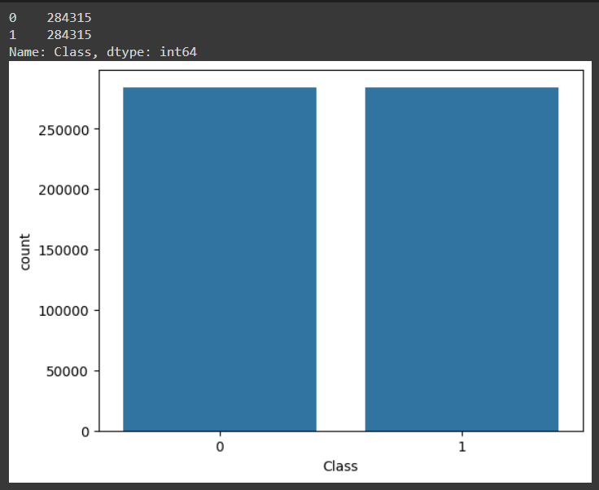
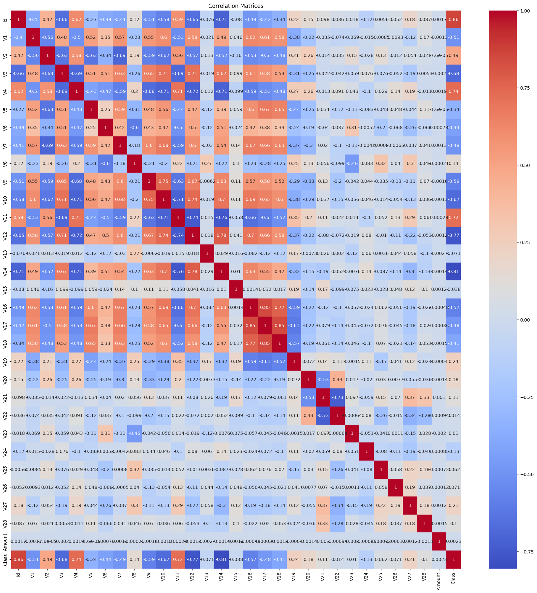

# Laporan Proyek Machine Learning - Hajid Lutfi Hidayanto

Proyek ini adalah proyek pertama untuk submission dicoding. Proyek ini berjudul **Credit Card Fraud Detection**, yaitu model machine learning yang dapat mendeteksi penipuan kartu kredit.

## Domain Proyek

Dalam era di mana teknologi terus berkembang, penggunaan kartu kredit meningkat secara pesat setiap tahunnya. Berdasarkan data dari [money.co.uk](money.co.uk), terdapat 1,2 milyar kartu kredit dalam sirkulasi dunia.

Peningkatan penggunaan kartu kredit yang secara pesat ini juga menimbulkan sisi negatif, yaitu peningkatan resiko dan frekuensi serangan penipuan kartu kredit. Tentunya ini adalah masalah yang tidak kecil dan berpotensi mengurangi jumlah pengguna kartu kredit. Jika jumlah pengguna kartu kredit turun, maka akan berdampak negatif pada ekonomi.

Salah satu cara untuk mengatasi hal ini adalah dengan membuat sistem credit card fraud detection untuk mencegah transaksi credit card yang terindikasi penipuan. Untuk membuat sistem tersebut, maka dibuat model machine learning. Dengan model yang baik, maka akurasi dalam mengidentifikasi transaksi penipuan kartu kredit tinggi. Hal ini dapat mempercepat proses investigasi penipuan kartu kredit. Selain itu, model juga dapat membantu mengurangi kerugian finansial akibat penipuan kartu kredit serta dapat meningkatkan kepuasan pengguna kartu kredit.

## Business Understanding

### Problem Statements

Pernyataan Masalah 1:

- Latar Belakang: Meningkatnya penggunaan kartu kredit diiringi dengan meningkatnya pula kasus penipuan kartu kredit.  
  
- Dampak:
    - Pengguna kartu kredit merasa tidak aman dan ragu untuk menggunakan kartu kredit dalam bertransaksi online.
    - Perusahaan mengalami kerugian finansial akibat transaksi penipuan.
    - Ekonomi terhambat karena menurunnya kepercayaan terhadap sistem pembayaran online.  
- Masalah: Bagaimana cara mengurangi kasus penipuan kartu kredit?  

Pernyataan Masalah 2:

- Latar Belakang: Sistem pendeteksi penipuan kartu kredit tradisional tidak selalu efektif dalam mendeteksi penipuan yang semakin canggih (seperti rule based system) ([researchgate](https://www.researchgate.net/publication/373157888_Comparative_Review_of_Credit_Card_Fraud_Detection_using_Machine_Learning_and_Concept_Drift_Techniques#fullTextFileContent)). 
- Dampak:
    - Pengguna kartu kredit merasa frustrasi dengan alarm palsu yang sering terjadi.
    - Perusahaan harus mengeluarkan biaya tambahan untuk memverifikasi transaksi yang dicurigai.
    - Sistem pendeteksi penipuan tidak efektif dalam mencegah penipuan kartu kredit.
- Masalah: Bagaimana cara meningkatkan efektivitas sistem pendeteksi penipuan kartu kredit?

### Goals

Menjawab Pernyataan Masalah 1  
Tujuan:

- Mengembangkan sistem pendeteksi penipuan kartu kredit dengan model machine learning yang akurat.
- Meningkatkan tingkat keamanan dan kenyamanan dalam bertransaksi online bagi pengguna kartu kredit.
- Mengurangi tingkat penipuan kartu kredit dan meningkatkan kepercayaan pengguna terhadap sistem pembayaran online.

Menjawab Pernyataan Masalah 2  
Tujuan:

- Mengembangkan sistem pendeteksi penipuan kartu kredit yang lebih efektif dan efisien dibandingkan dengan sistem tradisional.
- Meningkatkan tingkat akurasi sistem pendeteksi penipuan kartu kredit dan mengurangi alarm palsu.
- Menghemat biaya dan waktu yang dihabiskan untuk memverifikasi transaksi yang dicurigai.

### Solution statements
Solusi 1:

- Metode:  
    - Membangun model menggunakan algoritma *decision tree*
- Metrik Evaluasi:  
    - Akurasi: Persentase transaksi yang diklasifikasikan dengan benar sebagai penipuan atau bukan penipuan.
    - Precision: Persentase transaksi yang diklasifikasikan sebagai penipuan yang benar-benar merupakan penipuan.
    - Recall: Persentase transaksi penipuan yang berhasil diidentifikasi oleh model.
    - F1-score: Menunjukkan bahwa model cukup baik dalam mengidentifikasi transaksi penipuan, dengan keseimbangan yang baik antara precision dan recall.

Solusi 2:

- Metode:  
    - Membangun ensemble model dari *decision tree* (*Random Forest*).
    - Mengoptimalkan hyperparameter seperti *number of trees*, *maximum depth*, dan *minimum number of samples per leaf*
- Metrik Evaluasi:  
    - Akurasi: Persentase transaksi yang diklasifikasikan dengan benar sebagai penipuan atau bukan penipuan.
    - Precision: Persentase transaksi yang diklasifikasikan sebagai penipuan yang benar-benar merupakan penipuan.
    - Recall: Persentase transaksi penipuan yang berhasil diidentifikasi oleh model.
    - F1-score: Menunjukkan bahwa model cukup baik dalam mengidentifikasi transaksi penipuan, dengan keseimbangan yang baik antara precision dan recall.

Solusi 3:
- Metode:
    - Membangun model *neural network*
    - Mengoptimalkan hyperparameter seperti number of layers, number of neurons per layer, activation function, dan optimizer. 
- Metrik Evaluasi:  
    - Akurasi: Persentase transaksi yang diklasifikasikan dengan benar sebagai penipuan atau bukan penipuan.
    - Precision: Persentase transaksi yang diklasifikasikan sebagai penipuan yang benar-benar merupakan penipuan.
    - Recall: Persentase transaksi penipuan yang berhasil diidentifikasi oleh model.
    - F1-score: Menunjukkan bahwa model cukup baik dalam mengidentifikasi transaksi penipuan, dengan keseimbangan yang baik antara precision dan recall.

## Data Understanding
Dataset yang digunakan dalam proyek ini adalah dataset credit card fraud detection 2023 yang diunduh di  [Kaggle](https://www.kaggle.com/datasets/nelgiriyewithana/credit-card-fraud-detection-dataset-2023).

### Variabel-variabel pada Credit Card Fraud Detection Dataset adalah sebagai berikut:
- id : angka unik yang mengidentifikasi tiap data.
- v1, v2, v3, ..., v28 : merupakan features terkait atribut transaksi (time, location, etc) yang telah dipreprocess.
- Amount: jumlah transaksi.
- Class: label/kelas yang menentukan data adalah fraud ditandai dengan 1 atau non-fraud yang ditandai dengan 0.

## Exploratory Data Analysis
- Dataset sangat balance dengan jumlah sampel total sebanyak **568630** sampel dengan **284315** sampel pada **tiap kelas**.  
  
keterangan:  
0: non-fraud  
1: fraud

- Data merupakan data kuantitatif dan tidak ada data yang null dalam dataset.  

- Terdapat beberapa variable yang berkorelasi tinggi antara satu sama lain, maka akan coba digunakan PCA.  

## Data Preparation
- Train Test Split  
Train test split adalah teknik membagi dataset menjadi data training dan data testing. Dalam proyek ini, dataset dibagi menjadi 85% data training dan 15% data testing. Tahap ini sangat penting untuk membuat model dan menguji model.  
- Scaling  
Scaling adalah proses mengubah nilai data agar memiliki skala yang sama. Setelah di split, dataset di-scale agar model dapat lebih mudah dalam training. Pada proyek ini, digunakan scaling untuk meningkatkan performa model karena jika data tidak scaling, maka akan menyebabkan model bias terhadap fitur yang memiliki nilai yang lebih besar. Hal ini tentunya sangat berpengaruh terhadap performa model. Selain itu, scaling juga digunakan untuk mempercepat waktu training.  
- PCA   
PCA adalah teknik untuk mereduksi dimensi features dengan tetap mempertahankan sebagian besar informasinya. Pada proyek ini digunakan threshold PCA sebesar 95% variansi data. PCA digunakan karena jumlah features cukup banyak, yaitu 29 features. PCA mampu mereduksi dimensi features yang semula berjumlah 29 menjadi 22. Hal ini tentunya akan mempercepat waktu training dan mengurangi computational cost.

## Modeling
Pada proyek ini digunakan tiga algoritma machine learning, antara lain decision tree, random forest, dan neural network.

1. ***Decision Tree***

*Decision tree* adalah algoritma machine learning yang membangun tree untuk memprediksi nilai output berdasarkan nilai input. Pada proyek ini, *decision tree* dipakai sebagai base model untuk mengetahui bagaimana algoritma machine learning sederhana dilatih dengan dataset. Hasil performa model ini akan dipertimbangkan untuk memilih algoritma yang cocok diimplementasikan. Pada model ini, digunakan parameter `random state=42` dan beberapa parameter default lainnya. 

*Kelebihan *Decision Tree*:*
- Mudah dipahami dan diimplementasikan.
- Mampu menangani data kategorikal dan numerik.
- Bekerja dengan baik pada dataset kecil.

*Kekurangan *Decision Tree*:*
- Cenderung overfitting pada dataset kecil.
- Sensitif terhadap perubahan data.
- Kurang akurat dibandingkan algoritma lain pada dataset besar.

2. ***Random Forest***

*Random Forest* adalah algoritma machine learning yang merupakan kombinasi dari banyak *decision tree*. Algoritma ini membangun beberapa *decision tree* secara random dan kemudian menggabungkan hasil prediksi dari semua tree untuk menghasilkan prediksi akhir. Algoritma ini dipilih karena algoritma ini adalah pengembangan dari *decision tree*. Algoritma *decision tree* sebelumnya menghasilkan model yang baik, maka algoritma ini diperkirakan akan menghasilkan model yang baik juga. Pada proyek ini, parameter yang digunakan sebagai berikut:
- `n_estimators=50`: Jumlah tree yang digunakan adalah 50 tree.
- `max_depth=16`: Kedalaman maksimal sebuah tree adalah 16 nodes.
- `random_state=55`: Mengatur seed dengan 55.
- `n_jobs=-1`: Menggunakan semua cores CPU.

*Kelebihan *Random Forest*:*
- Lebih akurat dibandingkan *decision tree* tunggal.
- Mampu menangani overfitting.
- Bekerja dengan baik pada dataset besar.

*Kekurangan *Random Forest*:*
- Lebih kompleks dan sulit diinterpretasikan dibandingkan *decision tree*.
- Membutuhkan waktu yang lebih lama untuk pelatihan.

3. ***Neural Network***

Neural Network adalah algoritma machine learning yang terinspirasi dari struktur otak manusia. Algoritma ini terdiri dari beberapa lapisan neuron yang saling terhubung. Setiap neuron menerima input dari neuron sebelumnya dan menghasilkan output yang diteruskan ke neuron berikutnya. Algoritma ini dipilih karena jumlah dataset yang banyak. Algoritma neural network akan menghasilkan model yang buruk ketika data yang digunakan sedikit, tetapi dataset yang dipakai mempunyai 568630 sampel, maka algoritma ini berpotensi menghasilkan hasil yang baik. Layers yang digunakan adalah sebagai berikut:
- *Input layer*: Digunakan dense layer 128 neuron sebagai input layer dengan fungsi aktivasi ReLU dan menerima input shape (None, 22).
- *Hidden layer*: Terdapat dua hidden layer dengan dense layer 64 neuron menggunakan fungsi aktivasi ReLU.
- *Dropout layer*: Untuk menghindari overfitting, digunakan dropout layer dengan rate drop 0.25.
- *Output layer*: Digunakan dense layer 1 neuron dengan fungsi aktivasi sigmoid sebagai output layer.

*Kelebihan Neural Network:*
- Mampu belajar pola yang kompleks.
- Sangat akurat pada dataset besar.
- Bekerja dengan baik untuk berbagai jenis tugas, seperti klasifikasi, regresi, dan clustering.

*Kekurangan Neural Network:*
- Membutuhkan data yang banyak untuk pelatihan.
- Sulit diinterpretasikan.
- Membutuhkan waktu yang lama untuk pelatihan.

Model yang dipilih sebagai model terbaik adalah model Random Forest.  

## Evaluation
### Metriks evaluasi
Metriks evaluasi yang digunakan pada proyek ini sebagai berikut:  
1. **Akurasi**    

Akurasi mengukur proporsi prediksi yang benar dari total prediksi. Metrik ini dihitung dengan rumus:
$Akurasi = \dfrac{TP + TN}{TP + TN + FP + FN}
$

TP (True Positive): Jumlah prediksi positif yang benar.
TN (True Negative): Jumlah prediksi negatif yang benar.
FP (False Positive): Jumlah prediksi positif yang salah.
FN (False Negative): Jumlah prediksi negatif yang salah.

Akurasi merupakan metrik yang mudah dipahami dan diinterpretasikan, tetapi bisa menyesatkan pada dataset yang tidak seimbang.

2. **Precision**  

Precision mengukur proporsi prediksi positif yang benar dari total prediksi yang dikategorikan sebagai positif. Metrik ini dihitung dengan rumus:

$Precision = \dfrac{TP}{TP + FP}$

Precision menunjukkan seberapa akurat model dalam mengidentifikasi data positif.  

3. ***Recall***

*Recall* mengukur proporsi data positif yang benar-benar teridentifikasi oleh model. Metrik ini dihitung dengan rumus:

$Recall = \dfrac{TP}{TP + FN}
$

*Recall* menunjukkan seberapa baik model dalam menemukan semua data positif.  

4. ***F1-score***

*F1-Score* adalah rata-rata harmonis (harmonic mean) dari precision dan recall. Metrik ini dihitung dengan rumus:

$F1-Score = 2 \cdot \dfrac{Precision \cdot Recall}{Precision + Recall}
$

*F1-Score* memberikan keseimbangan antara precision dan recall, dan merupakan metrik yang lebih informatif dibandingkan akurasi pada dataset yang tidak seimbang.

### Hasil model

1. *Precision, recall, f1-score*
    - Decision Tree  
        |              | precision | recall | f1-score | support |
        |--------------|-----------|--------|----------|---------|
        | 0            | 1.00      | 1.00   | 1.00     | 42637   |
        | 1            | 1.00      | 1.00   | 1.00     | 42658   |
        | accuracy     |           |        | 1.00     | 85295   |
        | macro avg    | 1.00      | 1.00   | 1.00     | 85295   |
        | weighted avg | 1.00      | 1.00   | 1.00     | 85295   |
    - Random Forest  
        |              | precision | recall | f1-score | support |
        |--------------|-----------|--------|----------|---------|
        | 0            | 1.00      | 1.00   | 1.00     | 42637   |
        | 1            | 1.00      | 1.00   | 1.00     | 42658   |
        | accuracy     |           |        | 1.00     | 85295   |
        | macro avg    | 1.00      | 1.00   | 1.00     | 85295   |
        | weighted avg | 1.00      | 1.00   | 1.00     | 85295   |
    - Neural Network  
        |              | precision | recall | f1-score | support |
        |--------------|-----------|--------|----------|---------|
        | 0            | 1.00      | 1.00   | 1.00     | 42637   |
        | 1            | 1.00      | 1.00   | 1.00     | 42658   |
        | accuracy     |           |        | 1.00     | 85295   |
        | macro avg    | 1.00      | 1.00   | 1.00     | 85295   |
        | weighted avg | 1.00      | 1.00   | 1.00     | 85295   |
2. Akurasi  

    |       | DT       | NN       | RF       |
    |-------|----------|----------|----------|
    | train | 1.0      | 0.998963 | 0.999266 |
    | test  | 0.997245 | 0.998804 | 0.998816 |
        
Kekurangan dan kelebihan tiap model dalam memprediksi penipuan kartu kredit sebagai berikut:
1. *Decision tree*
    - Model mencapai akurasi 100% pada data train dan 99.72% pada data test.
    - Untuk data training, model ini mengungguli *random forest* dan *neural network*.
    - Untuk data testing, model ini paling rendah di antara ketiga model.
2. *Neural Network*
    - Model mencapai 99.89% akurasi pada data train dan 99.88% akurasi pada data test.
    - Performa model ini berada di tengah-tengah antara ketiga model.
3. *Random Forest*
    - Model mwncapai 99.92% akurasi pada data train dan 99.88% akurasi pada data test.
    - Untuk data testing, model ini *superior* terhadap kedua model yang lain.
    - Untuk data training, model ini beradda di tengah-tengah antara ketiga model.  

Berdasarkan analisis data, algoritma terbaik untuk **credit card fraud detection** adalah ***random forest*** karena memiliki overall akurasi yang paling baik di antara ketiga model.  

## Kesimpulan
Dalam implementasinya di lapangan, perbedaan sekian persen saja dapat berpergaruh besar terhadap output model. Dengan hasil akurasi lebih dari 99.88%, model dianggap dapat memenuhi goals 1 dan goals 2. Model dapat memprediksi transaksi penipuan kartu kredit secara akurat. Hal ini berimplikasi terdapat banyak hal, salah satunya sistem keamanan kartu kredit meningkat yang membuat kepercayaan pengguna juga meningkat. Selain itu, efektivitas sistem deteksi penipuan kartu kredit dalam hal waktu serta biaya juga akan meningkat. 

Meskipun performa model sudah baik dan tujuan sudah tercapai, model masih dapat diimprovisasi menjadi lebih baik lagi hyperparameter tuning model berpotensi dapat menjadi lebih baik.

## Referensi:   
- [The Impact Of Credit Card Usage On Consumer Spending And The Economy](https://www.outlookmoney.com/outlook-money-spotlight/the-impact-of-credit-card-usage-on-consumer-spending-and-the-economy-8846) 

- [Credit card facts and statistics: 2023](https://www.money.co.uk/credit-cards/credit-card-statistics#:~:text=Credit%20card%20network%20statistics,-There%20are%20somewhere&text=At%20the%20end%20of%20the%20first%20quarter%20of%202023%2C%20over,(AMEX)%20cards%20in%20circulation) 

- [Ileberi, Emmanuel, Yanxia Sun, and Zenghui Wang. "A machine learning based credit card fraud detection using the GA algorithm for feature selection." Journal of Big Data 9, no. 1 (2022): 1-17.](https://journalofbigdata.springeropen.com/articles/10.1186/s40537-022-00573-8)

- [Awoyemi, John O., Adebayo O. Adetunmbi, and Samuel A. Oluwadare. "Credit card fraud detection using machine learning techniques: A comparative analysis." In 2017 international conference on computing networking and informatics (ICCNI), pp. 1-9. IEEE, 2017.](https://ieeexplore.ieee.org/abstract/document/8123782)

- [Dornadula, Vaishnavi Nath, and Sa Geetha. "Credit card fraud detection using machine learning algorithms." Procedia computer science 165 (2019): 631-641.](https://www.sciencedirect.com/science/article/pii/S187705092030065X)

- [Tiwari, Pooja, Simran Mehta, Nishtha Sakhuja, Jitendra Kumar, and Ashutosh Kumar Singh. "Credit card fraud detection using machine learning: a study." arXiv preprint arXiv:2108.10005 (2021).](https://arxiv.org/pdf/2108.10005.pdf)  

- [Joshi, Abhishek, Shreedhar Soni, and Vaibhav Jain. "An Experimental Study using Unsupervised Machine Learning Techniques for Credit Card Fraud Detection."](https://www.researchgate.net/publication/353143969_An_Experimental_Study_using_Unsupervised_Machine_Learning_Techniques_for_Credit_Card_Fraud_Detection)

- [US Total Card Fraud Losses, by Channel, 2019-2024 (billions)](https://www.insiderintelligence.com/chart/260023/us-total-card-fraud-losses-by-channel-2019-2024-billions)

- [Adebayo, Oluwadare Samuel, Thompson Aderonke Favour-Bethy, Owolafe Otasowie, and Orogun Adebola Okunola. "Comparative Review of Credit Card Fraud Detection using Machine Learning and Concept Drift Techniques." Int. J. Comput. Sci. Mob. Comput 12 (2023): 24-48.](https://www.researchgate.net/publication/373157888_Comparative_Review_of_Credit_Card_Fraud_Detection_using_Machine_Learning_and_Concept_Drift_Techniques#fullTextFileContent)
